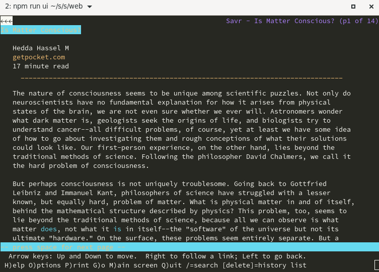
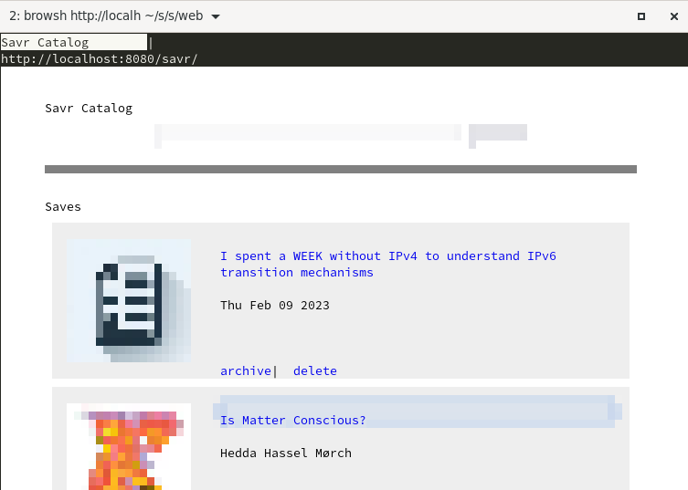

# Savr

Savr is an app for saving online content to read later. It is [file-centric, offline first, future proof](#offline-use), and [favors decentralization](#how-to-use-it). Read about the design and motivation in the [FAQ](#faq).

For the most part, Savr is an [Android app](#android) and a local [web app](#web). They can be used together or independently.

# Features

- Save articles for reading later
- Remove distractions like advertisements
- Read content without an internet connection
- Share articles with friends
- No dependency on a service/company to do the scraping or storage
- Scraped content works well outside the app (plain html and images)
- Plays well with file synchronization across devices. Just BYOB (bring your own backend).

# How to use it

When reading an article in a browser, share it to Savr. Then open Savr later to read it.

If you want to synchronize your articles for backup or for use across devices, just point your synchronization service to the Savr data directory.

Use something like [Nextcloud](https://nextcloud.com/) for a centralized option or [Syncthing](https://syncthing.net/) for a decentralized one. Or use a third party service like Google Drive.

# Current state of development

Basic features have been implemented, but I would consider this in a beta stage. While in the 0.x version number range, features will be stabilizing, along with the API contract and database schema.

# Android


## Installation

Since this is pre-release software, I have not put it in any app store. For now you can do one of the following:

- Use [Obtanium](https://obtainium.imranr.dev/) with the source URL: https://github.com/jonocodes/savr
- [Install the APK directly from the releases page](https://github.com/jonocodes/savr/releases/latest).

## Development

The [android app](./android/) uses Kotlin and depends heavily on the Storage Access Framework and Android WebView.

Build and debug using Andoid Studio.

More details TBD...

# Desktop

There currently is no desktop specific application. However the web app is intended for running locally to serve your desktop needs. It is a simple site designed to render well on small screens and text browsers.

# Web

<div align="center" width="100%">


</div>

## Use

The [web](./web/) project provides a local web app that can be used to save, read, and administer your articles. By default it runs at: http://localhost:8080/savr

To manually ingest an article enter the URL at the top of the page. If you want something less manual, use the [bookmarklet](#bookmarklet).

## Configuration

Set your local environment variable 'DATA_DIR' to be pointing an existing directory where you want Savr to store the database and content.

## Development

Here is how you may bring up the server locally.

```bash
export DATA_DIR=$HOME/savrdata  # or choose a different data location
mkdir $DATA_DIR

cd web
npm install
npm run web:dev
```

## Production

For now the simplest way to use the web project as a long running backend service is with docker.

```bash
export DATA_DIR=$HOME/savrdata
mkdir $DATA_DIR

cd web
docker compose up -d
```

## Security

Savrd is a single user service. It has no authentication or account management. However there are a couple things you can do.

### Token use

The default namespace is of the web service is '/savr'. However you can update it to be more complex via environment variable. For example you can generate a UUID:

```bash
node -e "const { randomUUID } = require('crypto'); console.log(randomUUID());"
```

and set it like so:

    SAVR_NAMESPACE="/savr/<uuid>"

This is a bit like token authentication. You can rotate it as often as you want, but will need to update your client references to the service.

This is mostly a feature to deter port scanners, so use at your own risk.

### SSL

You can put this behind a [reverse proxy](https://fastify.dev/docs/latest/Guides/Recommendations/) with an SSL certificate.

## Topologies

Here are some suggestions of how you may want to run your service. The following presumes you support a single user with multiple devices, and you want the same content on all devices.

### Decentralized

Run multiple Savr web services...

SAVR_SERVICE=http://localhost:8080/savr,http://host1:8080/savr

### Centralized

Run a single instance of the service...

TBD

### Public

If you want to access it outside your network ...

TBD

# Bookmarklet

<div align="center" width="100%">


</div>

There are several ways of creating a button in your browser to save the article you currently have open.

In your browser add a new bookmark. Edit it and set the name to something like "Savr save". Copy the code from here: [bookmarklet/savr-save.js](bookmarklet/savr-save.js) and paste it unto the URL field.

At the beginning of the bookmarklet code you should see something like this:

```js
const hosts = ["http://localhost:8080/savr"];
```

Edit that variable as needed to make sure that it is pointing to the URL of your running web app/service.

## Development

http://localhost:8080/savr/static/demo.html

# CLI

You can use the CLI for ingestion if you want.

```bash
cd web
npm install
tsx ./src/cli.ts <url>

savr ingest <url>
```

# TUI

<div align="center" width="100%">



</div>

Since the web service is run to render well in text browsers the TUI command is mostly a wrapper to your locally installed browser app...

savr gui --browser=firefox # defaults to lynx

SAVR_SERVICE=http://localhost..., ... , ...
SAVR_DATA=/home/...

first see if SERVICE is set
then see if DATA is set

more info TBD

If you know exactly how you want to browse, you can skip the TUI command. For example:

    browsh http://localhost:8080/savr

<div align="center" width="100%">



</div>

# Offline Use

The Savr apps do not need an internet connection to read content, since it has all been downloaded. Additionally you dont even need the app to read the articles since the HTML archive is self contained.

Just open ${DATA_DIR}/list.html in a web browser.

<div align="center" width="100%">


</div>

Of course you wont be able to modify your collection when the app is not running. Have a look at your data directory. It is simply organized so you can copy out single articles if needed.

# FAQ

## Why another read-it-later app?

I consider myself a self-hosting enthusiast, who does not like to self-host :smile:. I love open source and open formats, but I dont think every single purpose app should require a custom backend for it.

After using Pocket for 10+ years I decided it was time to take control of my own content collection. But why does Pocket need a special backend? Yes, it helps scrape the articles, but for the most part its just an API that handles authorization and storing content. Moving the scraping into the mobile app makes the backend no longer necessary.

Good examples of apps that work well with filesystems and open data formats are [Obsidian](https://obsidian.md/) (for notes) and [Keepass](https://keepass.info/) (for passwords). You can run them on mobile, or desktop. All the functionality is in the app and a server is not required.

Of course you can bring in a sync service if you want, but its up to you how you want to store things. Syncing would happen outside the app, which adds flexibility. My preference is to use Syncthing which provides a decentralized solution to sync data across my devices/machines.

Generally, **I would like more apps that exist in this space**. Like:
calendar, contacts, bookmark manager, and yes another todo app.

## Why not use an existing open source project?

There are some great projects like [Wallabag](https://wallabag.org/) and [Omnivore](https://github.com/omnivore-app/omnivore), but they require centralized hosting. Doing away with the server lets you not have to worry about:

- security
- certificates
- passwords
- redundancy
- uptime
- firewalls
- DNS
- authorization
- all the other things that come with system administration

## Is there a iOS app?

We need to figure out how to deal with the filesystem restrictions. Possibly use OS-provided storage providers a la [keepassium](https://github.com/keepassium/KeePassium#automatic-sync).
