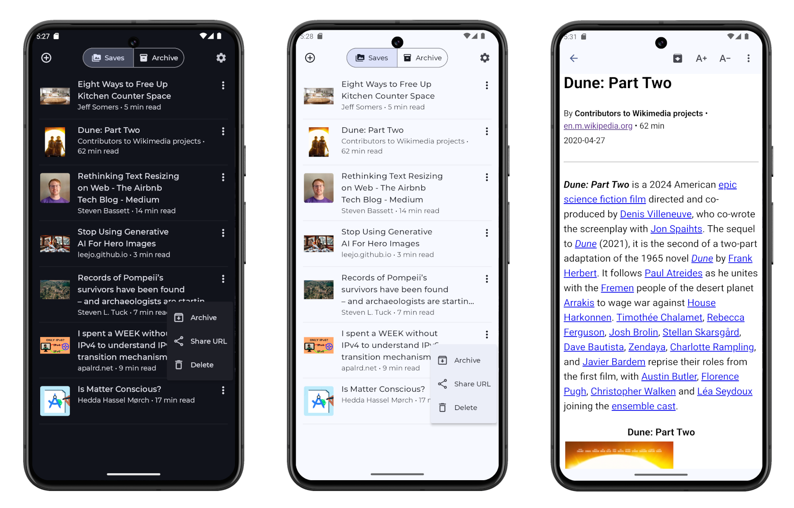
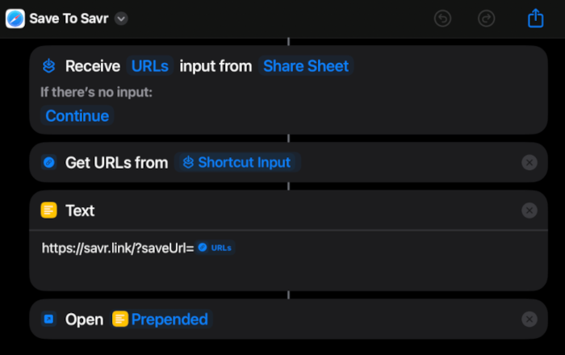
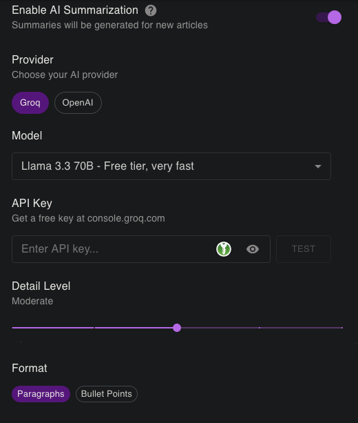

# Savr

Savr is an app for saving online content to read later.

**Use Savr here (hosted app): https://savr.link**

Savr is an app for saving online content to read later. It is [file-centric, offline first, future proof](#offline-use), and [favors decentralization](#how-to-use-it). Read about the design and motivation in the [FAQ](#faq).

When reading an article in a browser, share it to Savr. Then open Savr later to read it. Savr is a free, hosted or self hosted, progressive web app that works on-line, off-line, and on your phone.

Savr is:

- [0data](https://0data.app/) since it does not store your data. You do.
- [unhosted](https://unhosted.org/) since it is a static site with no backend.
- [local first](https://lofi.so/) since it works offline.



# Features

- Save articles for reading later
- Remove distractions like advertisements
- Read content and images without an internet connection
- No dependency on a service/company to do the scraping or storage
- Authorization and cross device synchronization optional (using your Dropbox or Google Drive)
- Learns your reading speed over time and personalizes estimated reading times
- Mark articles as favorites
- Light, dark, and system themes
- Toggle between a cleaned reader view and the original page
- Save content by pasting HTML, Markdown, or plain text, or by uploading PDFs and images
- Publish a read-only public copy of your collection
- Open source, cross platform (mobile and desktop/web)
- Use the free hosted version, or self host it
- Non-proprietary since it integrates with any browser and does not need specific extensions installed (see bookmarklet)

# Comparison

| Feature                          | Savr        | Pocket * | Omnivore * | Wallabag | [Shiori](https://github.com/go-shiori/shiori) |
| -------------------------------- | ----------- | -------------- | -------- | -------- | ------ |
| Open Source                      | ✅          | ❌              | ✅       | ✅       | ✅     |
| Requires minimal tech knowledge  | ✅          | ✅               | ❌       | ❌       | ❌     |
| Own/Control Your Data            | ✅          | ❌               | ✅       | ✅       | ✅     |
| Offline content including images | ✅          | sometimes cached  | ❌       | ❌       | ❌     |
| Other Content Types              | md, txt, pdf, images | ❌       | pdf       | pdf, epub   | ❌   |
| Offline mobile                   | ✅          | sometimes         | ✅       | ✅       | ❌     |
| Text To Speach                   | ✅          | ✅                | iOS only | android only | ❌     |
| Summary generation               | ✅          | ❌                 | ❌       | ❌       | ❌     |
| Cross Platform (+mobile/browser) | ✅          | ✅                 | ✅       | ✅       | ✅     |
| Cross Browser Extension          | ✅          | ❌ (chrome/FF)     | ❌       | ❌       | ❌     |
| Does not require an account      | ✅          | ❌                  | ❌       | ❌       | ❌     |

\* before service shutdown

# Progress

Here are most of the planned features.

- [x] offline content and image sync
- [x] browser bookmarklet
- [x] thumbnail generation
- [x] mobile share action
- [x] info edit - so you can fix a missing title
- [x] remember scroll position
- [x] text to speach read aloud
- [x] content summarization
- [x] offline sync using remoteStorage.js
- [x] catalog export
- [ ] catalog import
- [x] optional manual content uploading (via pasting, or file dialog) 
- [x] supports additional document types with auto-type detection (pasted html, markdown, plain text)
- [x] supports binary types (pdf, images)
- [ ] multiline url imports
- [ ] advanced image handling
  - [ ] scrape lazy loaded images
  - [ ] discover uncommon tags (ie - srcset and background images)
  - [ ] allow for deferred image loading at view time
- [ ] media types (audio, video) - You may want to check out our sister project [StashCast](https://github.com/jonocodes/stashcast)

See the [changelog](CHANGELOG.md) for the full history of shipped changes.


# How to "install" it

**Hosted app (recommended): https://savr.link**

Savr is a PWA (progressive web app) which means it primarily runs in a browser, but it can also be "installed" as an app on your phone. There it will work offline like your other mobile apps.

https://developer.mozilla.org/en-US/docs/Web/Progressive_web_apps/Guides/Installing

# How to save articles

## In app

When on the main screen you can always click the '+' button and enter a URL.

## Bookmarklet

The bookmarklet is the recommended way to save when using a desktop browser. Once you install it, you can click its link when you are on a page you want to save.

### Custom raw-content bookmarklets

Some pages hold content Savr can't extract on its own — for example a YouTube transcript, which is injected by the page's JavaScript and would be rejected by Readability. For these, a site-specific bookmarklet can do the extraction itself and hand Savr the finished content plus metadata (title, author, url). Savr stores it verbatim — no Readability, no scraping — via the raw-ingest path.

Such a bookmarklet opens Savr at `/?rawIngest=1` and, once Savr replies with a `savr-ready` message, posts:

```js
savrWindow.postMessage({
  action: "savr-raw",
  content,                 // the extracted text/HTML/markdown
  contentType: "text/plain", // or text/html, text/markdown, auto
  title, author, url,      // metadata stored as-is
}, savrOrigin);
```

A working example that scrapes a YouTube transcript lives at [`bookmarklet/savr-youtube-transcript.unminified.js`](bookmarklet/savr-youtube-transcript.unminified.js) — edit it there if you need to change it: the Savr app imports this same file (minified at build time by a Vite plugin) for the YouTube transcript bookmarklet on the Preferences screen, so it is the single source of truth. The `SAVR_ORIGIN` placeholder is substituted with the app's origin at runtime; for standalone use, replace it with your Savr origin, minify the file, and save it as a bookmarklet.

## In browser

Append the savr url to the front of the url you want to save. For example:

`savr.link/https://github.com/jonocodes/savr/wiki/Welcome-to-Savr`

If you are having trouble with the above path, there are several others that may work better. For example:

`https://savr.link/?saveUrl=https://github.com/jonocodes/savr/wiki/Welcome-to-Savr`

Note: The full url, including protocol (https://), is currently required for the article you want to save.

## Android

If you have ["installed" the PWA](#how-to-install-it), you can send articles to it. Once you visit an article in a mobile browser you can use the browsers "share" button to send it to your installed Savr app.

## iOS

iOS does not allow bookmarklets or sharing to PWAs. However here is a workaround that gets you most of the way there using an iOS shortcut. Click to install this:
https://www.icloud.com/shortcuts/84aaf265120b4fe69268b57b95bc4d14

Now you should be able to send any URL from an app to your web browser. Note this will specifically send the URL to the browser instance of Savr, not the PWA.

This should not be a problem though. You can log into Savr in the browser and the PWA, and [sync them to a cloud provider](#synchronization). That way when you sent to web, the PWA will get the same article.

If you want to create your own shortcut (particularly if you are hosting Savr yourself), here is how I built it.

<div align="center" width="100%">



</div>

# Synchronization

If you want to read and save articles on multiple devices you can authorize your cloud service provider (typically Dropbox or Google), to sync your articles. This is optional, and if you don't want to sync you don't need to create any account to use Savr.

Note that you don't need to sync your articles to a cloud service for them to be available offline. They are automatically saved to your device either way.

# AI Summarization

Savr can automatically generate summaries of your saved articles using an LLM to create concise summaries when you save new articles. Any provider with an OpenAI-compatible chat-completions endpoint works — including cloud services and local model servers.

**Supported Providers:**
- **Groq** - Fast, free summarization (Qwen and Llama models)
- **OpenAI** - GPT models for high-quality summaries
- **Gemini** - Google's models via their OpenAI-compatible endpoint
- **Local / Custom** - Point at any OpenAI-compatible server (llama.cpp's `llama-server`, Ollama, LM Studio, vLLM, OpenRouter, ...) by entering its URL and a model name

**Customization Options:**
- **Detail Level** - From brief overviews to comprehensive summaries
- **Format** - Choose between paragraphs or bullet points
- **Tone** - Neutral, formal, casual, or technical
- **Focus** - General summary, key facts, action items, main themes, or arguments
- **Custom Prompt** - Advanced users can define their own summarization prompt

To enable summarization, go to Preferences and toggle on "Enable AI Summarization". For cloud providers you'll need to provide an API key from your chosen provider (Groq offers free API keys). For the **Local / Custom** provider, enter the server's chat-completions URL (e.g. `http://localhost:8080/v1/chat/completions`) and the model name; an API key is usually optional.

To choose a model, either type its id directly or press the **refresh** button beside the model field to fetch the provider's current model list live from its `/v1/models` endpoint (requires the API key/URL to be set first, and a key for cloud providers). Model lists are fetched on demand rather than hardcoded, so they never go stale.

> **Note:** summaries are requested directly from your browser, so the provider must send permissive CORS headers. The major cloud providers and llama.cpp's `llama-server` do this by default. Ollama needs `OLLAMA_ORIGINS=*` (or your app's origin) set in its environment to allow browser requests.

<div align="center" width="100%">



</div>

# How it works

Savr is designed to work like a desktop app. It runs locally and minimizes the need for backend web services. This means that there is no Savr server that stores your info or content. It functions as a desktop app like your calculator or image editor in that you don't need to log in to use it. All content is on your device.

Savr runs entirely as a frontend app so if you want to self host you can use static hosting like github pages.

OK, I lied. You do need to use a CORS proxy server to help fetch new articles, but that is a generic service that has no knowledge of Savr.

(TODO: add more about architecture and article saving flow diagram)

[See this diagram](https://remotestorage.io/unhosted.html) showing how this type of architecture differs from traditional web apps.

# Current state of the project

Basic features have been implemented, but I would consider this in a beta stage. While in the 0.x version number range, features will be stabilizing, along with the API contract and database schema.

# Development

This is a front end react app. Run like so:

> npm install && npm run dev

Then visit http://localhost:3000

If you want to test PWA/production then do

> npm run build:prod && npm run start

Also note that if you host this on a static server, it should support SPA routing and you should serve this app from the root. This is needed to handle dealing with the single path parameter as a URL.

## E2E testing

Playwright e2e tests can be run through the repo scripts:

> npm run test:e2e

To quickly verify that Playwright is wired up without running the full suite:

> npm run test:e2e:smoke

To run one spec or forward Playwright filters:

> npm run test:e2e:single -- tests/e2e/smoke.spec.ts
> npm run test:e2e:single -- tests/e2e/main-page.spec.ts -g "should display"

# Security

All content is stored locally on your device. Savr has no server side storage. This makes it so we don't need to host any data, and so it can more simply be hosted by you if you want.

This also make it such that there is no login or account creation to use Savr. If you decide to synchronize your data across devices you will need to bring a cloud service. But that authentication is brokered through your browser and does not go through Savr's servers. In the browser your are authenticating directly to the cloud provider only.

# Privacy & telemetry

The hosted app at `savr.link` collects a small amount of **anonymous** usage data so we can answer basic questions like "how many people use Savr, roughly where are they, and are they installing it." It is designed to respect the project's privacy-first goals.

Telemetry is via [GoatCounter](https://www.goatcounter.com), which is cookieless and stores no persistent visitor id. Every data point is an anonymous count — GoatCounter has no per-event properties, so the only thing sent besides the event name is your country (derived server-side from your IP; the IP itself is discarded and never stored).

**The complete list of events** — this is everything Savr ever sends:

| Event | Sent when |
| ----- | --------- |
| `app-open` | The app is opened or loaded |
| `app-standalone` | The app is opened as an installed PWA (fired alongside `app-open`) |
| `capture-url` | An article is saved from a URL |
| `capture-bookmarklet` | An article is saved via the bookmarklet |
| `capture-raw` | An article is saved via a site-specific bookmarklet (pre-extracted content) |
| `capture-paste` | An article is saved by pasting text, HTML, or Markdown |
| `capture-file` | An article is saved by uploading a PDF or image |
| `capture-failed` | An article capture fails (used to spot CORS-proxy trouble; no URL or details attached) |
| `pwa-install-accepted` | The user accepts the PWA install prompt (Chromium only) |
| `pwa-install-dismissed` | The user dismisses the PWA install prompt (Chromium only) |
| `sync-connect-dropbox` | Cloud sync is connected to Dropbox |
| `sync-connect-googledrive` | Cloud sync is connected to Google Drive |

**What is never collected:** article URLs, titles, or content; your cloud account address or any identity; API keys; or anything that could identify you or what you read. Sync events record the provider **type** only, never the account.

**Opting out:** it is on by default but you can turn it off any time under **Preferences → Privacy → "Share anonymous usage statistics."** It is also automatically disabled if your browser sends a [Global Privacy Control](https://globalprivacycontrol.org/) signal.

**Self-hosting:** telemetry is **off by default** for self-hosted builds. It only activates when a GoatCounter endpoint is provided at build time:

- `VITE_GOATCOUNTER_URL` — your GoatCounter "count" endpoint, e.g. `https://yourcode.goatcounter.com/count`. Leave unset to disable telemetry entirely (the Privacy preference is then hidden).
- `VITE_GOATCOUNTER_SCRIPT` — optional; overrides the tracker script URL (defaults to `https://gc.zgo.at/count.js`).

**Excluding your own visits** (for maintainers): `localhost` and private networks are ignored by GoatCounter automatically, and you can exclude a specific browser by visiting the site once with `#toggle-goatcounter` appended to the URL. See [GoatCounter's docs](https://www.goatcounter.com/help/skip-dev).

# Offline Use

The Savr apps do not need an internet connection to read content, since it has all been downloaded. Additionally you don't even need the app to read the articles since the HTML archive is self contained.

</div>

Of course you wont be able to modify your collection when the app is not running. Have a look at your data directory. It is simply organized so you can copy out single articles if needed.

# FAQ

## What makes Savr easier than other read-it-later apps?

There is nothing to install and nothing to sign up for. You don't download an app, stand up a server, or create an account — you just [open the site](https://savr.link) and start saving.

Because Savr is a [static web app with no backend](#why-not-use-an-existing-open-source-project), everything runs right in your browser:

- **No account.** Your articles are saved straight to your device. Syncing across devices is optional, and if you want it you use [your own Dropbox or Google Drive](#synchronization) — there's still no Savr account to manage.
- **No install required.** It works in any browser. If you want an app-like experience you can optionally ["install" it as a PWA](#what-is-a-pwa), but you never have to.
- **No extension to add.** Save from any browser with the [bookmarklet](#what-is-a-bookmarklet) or by [prepending the Savr URL](#in-browser) — no store-specific extension needed.
- **Nothing to maintain.** With no server, there's nothing for you (or a company) to keep online, patch, or pay for.

## What makes Savr an app for power users?

Under the simple surface there's a lot of depth for people who want more control:

- **Save more than just web articles.** Beyond scraping a URL, you can [paste HTML, Markdown, or plain text, or upload PDFs and images](#features), with automatic content-type detection.
- **Adaptive reading times.** Savr learns your reading speed over time and personalizes the estimated reading time for each article, instead of assuming a fixed words-per-minute.
- **AI summaries, your way.** Generate summaries with [any OpenAI-compatible provider](#ai-summarization) — cloud or a local model server — and tune the detail level, format, tone, and focus, or supply your own prompt.
- **Text-to-speech.** Have articles read aloud, cross-platform.
- **Own your data as plain files.** Everything is stored in open, [future-proof file formats](#offline-use) you can read, back up, or process with other tools — no proprietary database to escape.
- **Bring your own infrastructure.** Point Savr at [your own CORS proxy](#what-is-cors) for better reliability, speed, and privacy, and self-host the whole thing if you want.
- **Publish a public copy.** Share a read-only public version of your collection.
- **Reader or original.** Toggle between the cleaned, distraction-free reader view and the original page.

## Why another read-it-later app?

I consider myself a self-hosting enthusiast, who does not like to self-host :smile:. I love open source and open formats, but I don't think every single purpose app should require a custom backend for it.

After using Pocket for 10+ years I decided it was time to take control of my own content collection. But why does Pocket need a special backend? Yes, it helps scrape the articles, but for the most part its just an API that handles authorization and storing arbitrary content. Moving the scraping into the client app makes the backend no longer necessary.

Good examples of apps that work well with filesystems and open data formats are [Obsidian](https://obsidian.md/) (for notes) and [Keepass](https://keepass.info/) (for passwords). You can run them on mobile, or desktop. All the functionality is in the app and a server is not required.

Generally, **I would like more apps that exist in this space**. Like:
calendar, contacts, [bookmark manager](https://github.com/sissbruecker/linkding), [inventory](https://inventree.org/), [physical document management](https://docs.paperless-ngx.com/), and yes - another todo app.

## Why not use an existing open source project?

There are some great projects like [Wallabag](https://wallabag.org/) and [Omnivore](https://github.com/omnivore-app/omnivore), but they require centralized hosting. Doing away with the server lets you not have to worry about:

- storage
- certificates
- passwords
- redundancy
- uptime
- firewalls
- DNS
- authorization
- many of the other things that come with system administration

## What is CORS

CORS (Cross-Origin Resource Sharing) is a security feature implemented by web browsers that prevents websites from making requests to different domains. This is a security measure to protect users from malicious websites that might try to access data from other sites.

**Why does Savr need it?**  
When you save an article, Savr needs to fetch the content from the original website. However, due to CORS restrictions, many websites tell thew browser they want content blocked if loaded from a different domain. This often prevents Savr from fetching content and images.

**How does Savr solve this?**  
Savr uses a CORS proxy server that acts as a middleman. Instead of your browser directly requesting content from the original website, it requests it through the proxy server, which then fetches the content and sends it back to Savr.

**Why bring your own proxy?**  
While Savr provides a default proxy, you can configure your own CORS proxy server for:

- **Better reliability**: Public proxies can be unstable or go down
- **Faster performance**: Your own proxy is typically faster than shared public ones
- **More control**: You can configure it exactly how you need it
- **Privacy**: Your requests aren't going through a third-party service

You can learn more about CORS on [Wikipedia](https://en.wikipedia.org/wiki/Cross-origin_resource_sharing).

If you need to setup a simple free CORS proxy, [follow these instructions](https://gist.github.com/DankTechnologies/8dd399de6a588085eea26517048b7366).

## What is a PWA

A PWA (Progressive Web App) is a web application that can be installed on your device like a native app. PWAs work offline, can send notifications, and provide an app-like experience while running in your browser. You can "install" them from your browser's menu, and they'll appear in your app launcher alongside other apps.

Learn more about PWAs on [MDN Web Docs](https://developer.mozilla.org/en-US/docs/Web/Progressive_web_apps).

## What is a bookmarklet

A bookmarklet is a small piece of JavaScript code stored as a bookmark in your browser. When you click on it, it runs the JavaScript code on the current page. In Savr's case, the bookmarklet extracts the current page's URL and opens Savr with that URL ready to be saved.

Bookmarklets work across all browsers and don't require any extensions or special permissions. They're a simple, lightweight way to add functionality to any website.

Learn more about bookmarklets on [Wikipedia](https://en.wikipedia.org/wiki/Bookmarklet).
