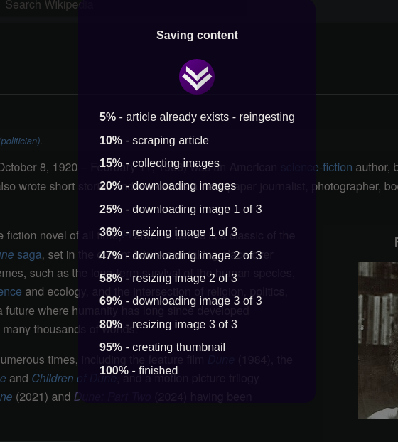

# Savr

Savr is an app for saving online content to read later. It is [file-centric, offline first, future proof](#offline-use), and [favors decentralization](#how-to-use-it). Read about the design and motivation in the [FAQ](#faq).

When reading an article in a browser, share it to Savr. Then open Savr later to read it. For the most part, Savr is a free, hosted or self hosted, progressive web app. You can also install it on your phone for offline use.

# Features

- Save articles for reading later
- Remove distractions like advertisements
- Read content and images without an internet connection
- No dependency on a service/company to do the scraping or storage
- Authorization and cross device syncronization optional (using your Dropbox or Google Drive)
- Open source, cross platform (mobile and desktop/web)
- Use the free hosted version, or self host it
- Non-propietary since it integrates with any browser and does not need specific extentions installed (see bookmarklet)

# How to "install" it

Savr is a PWA (progressive web app) which means it primarilly runs in a browser, but it can also be "installed" as an app on your phone. There it will work offline like your other mobile apps.

https://developer.mozilla.org/en-US/docs/Web/Progressive_web_apps/Guides/Installing

# How to save articles

## In app

When on the main screen you can always click the '+' button and enter a URL.

## Bookmarklet

The bookmarklet is the recommended way to save when using a desktop browser. Once you install it, you can click its link when you are on a page you want to save.

(show screen shot of bookmarklet link)

You should also be able to use the bookmarklet in your mobile web browser if you want.

## Android (share to)

If you have "installed" the mobile app, you can send articles to it. Once you visit an article in a mobile browser you can use the browsers "share" button to send it to your installed Savr app.

## iOS

iOS does not allow for sharing to progressive web apps. So use one of the other methods mentioned above.

# Synchronization

If you want to read and save articles on multiple devices you can authorize your cloud service provider (typically Dropbox or Google), to sync your articles. This is optional, and if you dont want to sync you dont need to create any account to use Savr.

Note that you dont need to sync your articles to a cloud service for them to be available offline. They are automatically saved to your device either way.

# How it works

Savr is designed to work like a desktop app. It runs locally and minimizes the need for backend web services. This means that there is no Savr server that stores your info or content. It functions as a desktop app like your calculator or image editor in that you dont need to log in to use it. All content is on your device.

Savr runs entirely as a frontend app so if you want to self host you can use static hosting like github pages.

OK, I lied. You do need to use a CORS proxy server to help fetch new articles, but that is a generic service that has no knowledge of Savr.

(TODO: add more about architecture and article saving flow diagram)

# Current state of development

Basic features have been implemented, but I would consider this in a beta stage. While in the 0.x version number range, features will be stabilizing, along with the API contract and database schema.

# Android

# Development

This is a front end react app. Run like so:

> npm install
> npm run dev

Then visit https://localhost:3000

# Security

All content is stored locally on your device. Savr has no server side storage. This makes it so we dont need to host any data, and so it can more simply be hosted by you if you want.

This also make it such that there is no login or account creation to use Savr. If you decide to synchronize your data across devices you will need to bring a cloud service. But that authentication is brokered through your browser and does not go through Savr's servers. In the browser your are authenticating direcly to the cloud provider only.

# Comparison

| Feature                           | savr | Pocket 2024 (before shutdown) | Omnivore | Wallabag | Shiori | Pocket 2025 |
| --------------------------------- | ---- | ----------------------------- | -------- | -------- | ------ | ----------- |
| Open Source                       | ✓    | ✗                             |          |          |        |             |
| Requires Tech Knowledge           |      |                               |          |          |        |             |
| Own/Control Your Data             |      |                               |          |          |        |             |
| Advanced Organization and Tagging |      |                               |          |          |        |             |
| Other Content Types               |      |                               |          |          |        |             |
| Works Offline                     |      |                               |          |          |        |             |
| Cross Platform                    |      |                               |          |          |        |             |
| Cross Browser Extension           |      |                               |          |          |        |             |

Requires creating an account

# Bookmarklet

# Offline Use

The Savr apps do not need an internet connection to read content, since it has all been downloaded. Additionally you dont even need the app to read the articles since the HTML archive is self contained.

Just open ${DATA_DIR}/list.html in a web browser.

Of course you wont be able to modify your collection when the app is not running. Have a look at your data directory. It is simply organized so you can copy out single articles if needed.

# FAQ

## Why another read-it-later app?

TODO: refer to https://0data.app/, https://unhosted.org/ and https://lofi.so/ apps, as concepts.

I consider myself a self-hosting enthusiast, who does not like to self-host :smile:. I love open source and open formats, but I dont think every single purpose app should require a custom backend for it.

After using Pocket for 10+ years I decided it was time to take control of my own content collection. But why does Pocket need a special backend? Yes, it helps scrape the articles, but for the most part its just an API that handles authorization and storing content. Moving the scraping into the mobile app makes the backend no longer necessary.

Good examples of apps that work well with filesystems and open data formats are [Obsidian](https://obsidian.md/) (for notes) and [Keepass](https://keepass.info/) (for passwords). You can run them on mobile, or desktop. All the functionality is in the app and a server is not required.

Of course you can bring in a sync service if you want, but its up to you how you want to store things. Syncing would happen outside the app, which adds flexibility. My preference is to use Syncthing which provides a decentralized solution to sync data across my devices/machines.

Generally, **I would like more apps that exist in this space**. Like:
calendar, contacts, [bookmark manager](https://github.com/sissbruecker/linkding), [inventory](https://inventree.org/), [physical document management](https://docs.paperless-ngx.com/), and yes - another todo app.

## Why not use an existing open source project?

There are some great projects like [Wallabag](https://wallabag.org/) and [Omnivore](https://github.com/omnivore-app/omnivore), but they require centralized hosting. Doing away with the server lets you not have to worry about:

- security
- certificates
- passwords
- redundancy
- uptime
- firewalls
- DNS
- authorization
- all the other things that come with system administration

## What is CORS

## What is a PWA

## What is a bookmarklet
