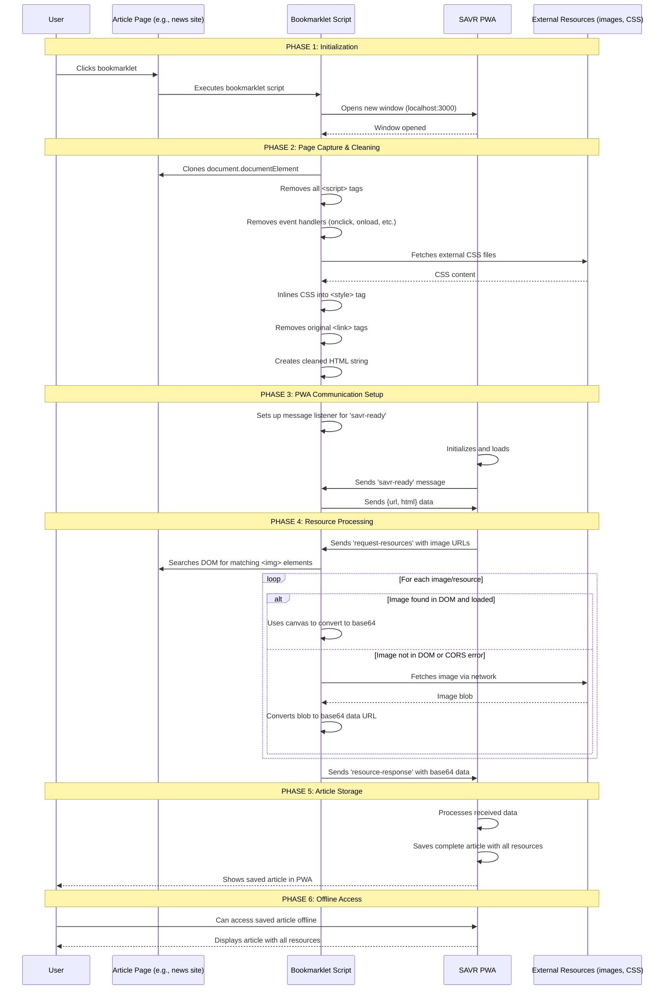

# Bookmarklet Flow Diagram

## Key Components

### Security Measures

- **Script Removal**: All `<script>` tags are removed
- **Event Handler Stripping**: All `onclick`, `onload`, etc. attributes removed
- **CORS Bypass**: External resources converted to base64 data URLs

### Resource Handling Strategy

1. **DOM First**: Look for already-loaded images in the page
2. **Canvas Conversion**: Use canvas API to extract base64 from loaded images
3. **Network Fallback**: Fetch from network if not in DOM

### Communication Protocol

- **Message Types**:
  - `'savr-ready'`: PWA signals it's ready to receive data
  - `'request-resources'`: PWA requests specific image URLs
  - `'resource-response'`: Bookmarklet sends base64 data back

### Data Flow

1. **HTML**: Cleaned and inlined CSS
2. **Images**: Converted to base64 data URLs
3. **Complete Package**: Self-contained article ready for offline storage
